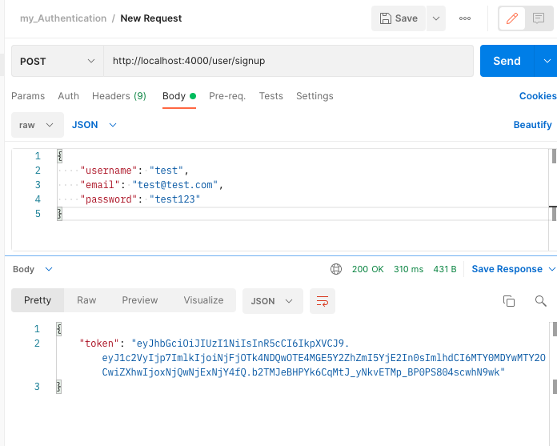

# Node_Authentication :smiley:

Guide for making a production ready authentication API utilizing json web tokens [JWT](https://jwt.io/)

# System Requirements

- [Node](https://nodejs.dev/learn/how-to-install-nodejs)
- [NPM](https://docs.npmjs.com/cli/v7/configuring-npm/install)
- [Git Bash](https://www.gitkraken.com/blog/what-is-git-bash)

# What is JWT and why is it useful?

JWT is useful for Authorization and Information exchange. Can be sent via URL/ Post request/HTTP Header which makes it fast for transmission and usable. It contains the details of user (not session id in cookies like traditional request) so , :drum: :drum: :drum: , NO need to query database to get user details.

# What to Know?

You should know the basics of javascript and node, so this guide assumes both.

We will be using MongoDB Atlas Cloud Database to store our users. [For more info...](https://docs.atlas.mongodb.com/)

## Instructions for MongoDB Atlas (this is where you get your connection string needed later)

1. Visit [Official Docs](https://docs.atlas.mongodb.com/) , After signing up, click on `+ New Project`
2. Name your project
3. Click `Create Project`
4. Click `Build a Database`
5. Select FREE tier and click `Create`
6. Choose a cloud provider, I chose AWS, but any will do
7. Choose a region, any
8. Scroll to the bottom and click `Create Cluster` (could take several minutes)
9. Create a User, entering in a username and password and then clicking `Create User`
10. Select where you would like to connect from, select local, and then click `Add My Current Ip Address`
11. Click `Finish and Close` at the bottom of page
12. In Database Deployments Click the `Connect` button next to your cluster name
13. Click `Connect your application`, here is where you can get your connection string. :smile:

---

## NPM packages we will be using

- [express](http://expressjs.com/)

- [express-validator](https://express-validator.github.io/docs/)

- [bcryptjs](https://www.npmjs.com/package/bcrypt)

- [JWT](https://jwt.io/)

- [mongoose](https://mongoosejs.com/docs/)

- [dotenv](https://www.npmjs.com/package/dotenv)

# Initiate your project

1. Create a new folder call it 'my-authentication'
2. Pull up terminal/git bash and execute this statement below

```
npm init
```

3. Npm init will ask basic info, fill out accordingly
4. Install all packages mentioned previously

```
npm install express express-validator bcryptjs jsonwebtoken mongoose dotenv --save
```

5. Now create a file `index.js` at the root adding this code

```js
const express = require("express");

const app = express();

// PORT
const PORT = process.env.PORT || 4000;

app.get("/", (req, res) => {
  res.json({ message: "API Working" });
});

app.listen(PORT, (req, res) => {
  console.log(`Server Started at PORT ${PORT}`);
});
```

6. Last step is to test, execute below, should see 'server will start at PORT 4000' in terminal

```
node index.js
```

# Create User Model

7. Create `.env` file at the root of your app, here is where you will store your connection string you recieved earlier doing the mongoDB Atlas section. Inside the `.env` file add this as well as your connection string:

```
DB_URI=yourSecretConnectionStringGoesHere
```

Warning, if your connection string password has special characters you will need it encoded for more info you can get the encoded version of your password [here](https://www.w3schools.com/html/html_urlencode.asp) by entering it in the `Try It Yourself` input.

8. Create a `config` folder and inside create a `db.js`, add code below

```js
const mongoose = require("mongoose");
require("dotenv").config();

// Replace this with your MONGOURI.
const MONGOURI = process.env.DB_URI;

const InitiateMongoServer = async () => {
  try {
    await mongoose.connect(MONGOURI, {
      useNewUrlParser: true,
    });
    console.log("Connected to DB !!");
  } catch (e) {
    console.log(e);
    throw e;
  }
};

module.exports = InitiateMongoServer;
```

> Notice InitiateMongoServer is an `async` function, We will be using [async await](https://javascript.info/async-await) to work with promises. The word `async` before a function means one simple thing: a function always returns a promise. Other values are wrapped in a resolved promise automatically.

9. Test by running`node index.js` in your terminal, expect server to connect
10. Create a `model` folder and inside create a `User.js` (Capitalized), add code below

```js
const mongoose = require("mongoose");

const UserSchema = mongoose.Schema({
  username: {
    type: String,
    required: true,
  },
  email: {
    type: String,
    required: true,
  },
  password: {
    type: String,
    required: true,
  },
  createdAt: {
    type: Date,
    default: Date.now(),
  },
});

// export model user with UserSchema
module.exports = mongoose.model("user", UserSchema);
```

11. Update `index.js` adding code below

```js
const express = require("express");
const bodyParser = require("body-parser");
const InitiateMongoServer = require("./config/db");

// Initiate Mongo Server
InitiateMongoServer();

const app = express();

// PORT
const PORT = process.env.PORT || 4000;

// Middleware
app.use(bodyParser.json());

app.get("/", (req, res) => {
  res.json({ message: "API Working" });
});

app.listen(PORT, (req, res) => {
  console.log(`Server Started at PORT ${PORT}`);
});
```

> Notice we add [body-parser](https://www.npmjs.com/package/body-parser) which we will use to parse incoming request bodies.

# Make Route for User signup

If new to routing click [here](https://expressjs.com/en/starter/basic-routing.html) to learn basics

12. Create a `routes` folder and inside create a `user.js` file. Add code below

```js
const express = require("express");
const { check, validationResult } = require("express-validator");
const bcrypt = require("bcryptjs");
const jwt = require("jsonwebtoken");
const router = express.Router();

const User = require("../model/User");

/**
 * @method - POST
 * @param - /signup
 * @description - User SignUp
 */

router.post(
  "/signup",
  [
    check("username", "Please Enter a Valid Username").not().isEmpty(),
    check("email", "Please enter a valid email").isEmail(),
    check("password", "Please enter a valid password").isLength({
      min: 6,
    }),
  ],
  async (req, res) => {
    const errors = validationResult(req);
    if (!errors.isEmpty()) {
      return res.status(400).json({
        errors: errors.array(),
      });
    }

    const { username, email, password } = req.body;
    try {
      let user = await User.findOne({
        email,
      });
      if (user) {
        return res.status(400).json({
          msg: "User Already Exists",
        });
      }

      user = new User({
        username,
        email,
        password,
      });

      const salt = await bcrypt.genSalt(10);
      user.password = await bcrypt.hash(password, salt);

      await user.save();

      const payload = {
        user: {
          id: user.id,
        },
      };

      jwt.sign(
        payload,
        "randomString",
        {
          expiresIn: 10000,
        },
        (err, token) => {
          if (err) throw err;
          res.status(200).json({
            token,
          });
        }
      );
    } catch (err) {
      console.log(err.message);
      res.status(500).send("Error in Saving");
    }
  }
);

module.exports = router;
```

This will be a post request using [express-validator](https://express-validator.github.io/docs/) for our signup form validation, [bcrypt](https://www.npmjs.com/package/bcrypt) to hash our users password, and [jsonwebtoken](https://jwt.io/) to encrypt our payload.

13. Import in `index.js` like below and middleware to handles CORs

```js
const express = require("express");
const bodyParser = require("body-parser");
const user = require("./routes/user"); //new addition
const InitiateMongoServer = require("./config/db");

// Initiate Mongo Server
InitiateMongoServer();

const app = express();

// PORT
const PORT = process.env.PORT || 4000;

// Middleware
app.use(bodyParser.json());
app.use(express.urlencoded({ extended: true }));
app.use(express.json());
app.use(function (req, res, next) {
  res.header("Access-Control-Allow-Origin", "http://localhost:3000"); // update to match the domain you will make the request from
  res.header(
    "Access-Control-Allow-Headers",
    "token, Origin, X-Requested-With, Content-Type, Accept"
  );
  next();
});

// Middleware
app.use(bodyParser.json());

app.get("/", (req, res) => {
  res.json({ message: "API Working" });
});

/**
 * Router Middleware
 * Router - /user/*
 * Method - *
 */
app.use("/user", user);

app.listen(PORT, (req, res) => {
  console.log(`Server Started at PORT ${PORT}`);
});
```

14. Test using postman. If you don't have postman, click [here](https://learning.postman.com/docs/getting-started/installation-and-updates/) to install and setup. Expect results below.



# Make Route for User login.

15. Add code below to `user.js`

```js
router.post(
  "/login",
  [
    check("email", "Please enter a valid email").isEmail(),
    check("password", "Please enter a valid password").isLength({
      min: 6,
    }),
  ],
  async (req, res) => {
    const errors = validationResult(req);

    if (!errors.isEmpty()) {
      return res.status(400).json({
        errors: errors.array(),
      });
    }

    const { email, password } = req.body;
    try {
      let user = await User.findOne({
        email,
      });
      if (!user)
        return res.status(400).json({
          message: "User Not Exist",
        });

      const isMatch = await bcrypt.compare(password, user.password);
      if (!isMatch)
        return res.status(400).json({
          message: "Incorrect Password !",
        });

      const payload = {
        user: {
          id: user.id,
        },
      };

      jwt.sign(
        payload,
        "randomString",
        {
          expiresIn: 3600,
        },
        (err, token) => {
          if (err) throw err;
          res.status(200).json({
            token,
          });
        }
      );
    } catch (e) {
      console.error(e);
      res.status(500).json({
        message: "Server Error",
      });
    }
  }
);
```

16. Test using postman.

# Make Route to Get User.

17. We get tokens back from both user signup and user login, now lets add route to get a user via token. Add code below.

```js
const auth = require("../middleware/auth");
```

```js
router.get("/me", auth, async (req, res) => {
  try {
    // request.user is getting fetched from Middleware after token authentication
    const user = await User.findById(req.user.id);
    res.json(user);
  } catch (e) {
    res.send({ message: "Error in Fetching user" });
  }
});
```

If you run the server you will get an error from the auth parameter so lets make that function.

18. Create a `middleware` folder and inside create a `auth.js` adding the code below.

```js
const jwt = require("jsonwebtoken");

module.exports = function (req, res, next) {
  const token = req.header("token");
  if (!token) return res.status(401).json({ message: "Auth Error" });

  try {
    const decoded = jwt.verify(token, "randomString");
    req.user = decoded.user;
    next();
  } catch (e) {
    console.error(e);
    res.status(500).send({ message: "Invalid Token" });
  }
};
```

This function will be used to verify the users token

19. Test using postman. After signing up a user, try getting that same user passing the token you got from signup to the request header


# Make Controller file for user routes and clean up routes file

This folder will help us when we add more routes to this API keeping our route files shorter and more manageable

20. Create a `controllers` folder and add user.js, add route logic

```js
const { validationResult } = require("express-validator");
const bcrypt = require("bcryptjs");
const jwt = require("jsonwebtoken");

const User = require("../model/User");

exports.signUp = async (req, res) => {
  const errors = validationResult(req);
  if (!errors.isEmpty()) {
    return res.status(400).json({
      errors: errors.array(),
    });
  }

  const { username, email, password } = req.body;
  try {
    let user = await User.findOne({
      email,
    });
    if (user) {
      return res.status(400).json({
        msg: "User Already Exists",
      });
    }

    user = new User({
      username,
      email,
      password,
    });

    const salt = await bcrypt.genSalt(10);
    user.password = await bcrypt.hash(password, salt);

    await user.save();

    const payload = {
      user: {
        id: user.id,
      },
    };

    jwt.sign(
      payload,
      "randomString",
      {
        expiresIn: 10000,
      },
      (err, token) => {
        if (err) throw err;
        res.status(200).json({
          token,
        });
      }
    );
  } catch (err) {
    console.log(err.message);
    res.status(500).send("Error in Saving");
  }
};

exports.loginUser = async (req, res) => {
  const errors = validationResult(req);

  if (!errors.isEmpty()) {
    return res.status(400).json({
      errors: errors.array(),
    });
  }

  const { email, password } = req.body;
  try {
    let user = await User.findOne({
      email,
    });
    if (!user)
      return res.status(400).json({
        message: "User Not Exist",
      });

    const isMatch = await bcrypt.compare(password, user.password);
    if (!isMatch)
      return res.status(400).json({
        message: "Incorrect Password !",
      });

    const payload = {
      user: {
        id: user.id,
      },
    };

    jwt.sign(
      payload,
      "randomString",
      {
        expiresIn: 3600,
      },
      (err, token) => {
        if (err) throw err;
        res.status(200).json({
          token,
        });
      }
    );
  } catch (e) {
    console.error(e);
    res.status(500).json({
      message: "Server Error",
    });
  }
};

exports.getMe = async (req, res) => {
  try {
    // request.user is getting fetched from Middleware after token authentication
    const user = await User.findById(req.user.id);
    res.json(user);
  } catch (e) {
    res.send({ message: "Error in Fetching user" });
  }
};
```

21. Update `user.js` in routes folder to import controller logic

```js
const express = require("express");
const { check } = require("express-validator");

const auth = require("../middleware/auth");
const { signUp, loginUser, getMe } = require("../controllers/user");

const router = express.Router();

router.post(
  "/signup",
  [
    check("username", "Please Enter a Valid Username").not().isEmpty(),
    check("email", "Please enter a valid email").isEmail(),
    check("password", "Please enter a valid password").isLength({
      min: 6,
    }),
  ],
  signUp
);

router.post(
  "/login",
  [
    check("email", "Please enter a valid email").isEmail(),
    check("password", "Please enter a valid password").isLength({
      min: 6,
    }),
  ],
  loginUser
);

router.get("/me", auth, getMe);

module.exports = router;
```

<!-- # Lets make a middleware function to clean up all of our try catch statements in our controller file, and handle our errors

22. Add file to middleware naming it `asyncHandler.js` adding code below

```js
const asyncHandler = (fn) => (req, res, next) =>
  Promise.resolve(fn(req, res, next)).catch(next);

module.exports = asyncHandler;
```

23. Update controller file by removing all try catches and wrapping methods in asyncHandler like below

```js
const { validationResult } = require("express-validator");
const bcrypt = require("bcryptjs");
const jwt = require("jsonwebtoken");
const asyncHandler = require("../middleware/asyncHandler");

const User = require("../model/User");

exports.signUp = asyncHandler(async (req, res) => {
  const errors = validationResult(req);
  if (!errors.isEmpty()) {
    return res.status(400).json({
      errors: errors.array(),
    });
  }

  const { username, email, password } = req.body;

  let user = await User.findOne({
    email,
  });
  if (user) {
    return res.status(400).json({
      msg: "User Already Exists",
    });
  }

  user = new User({
    username,
    email,
    password,
  });

  const salt = await bcrypt.genSalt(10);
  user.password = await bcrypt.hash(password, salt);

  await user.save();

  const payload = {
    user: {
      id: user.id,
    },
  };

  jwt.sign(
    payload,
    "randomString",
    {
      expiresIn: 10000,
    },
    (err, token) => {
      if (err) throw err;
      res.status(200).json({
        token,
      });
    }
  );

  console.log(err.message);
  res.status(500).send("Error in Saving");
});

exports.loginUser = asyncHandler(async (req, res) => {
  const errors = validationResult(req);

  if (!errors.isEmpty()) {
    return res.status(400).json({
      errors: errors.array(),
    });
  }

  const { email, password } = req.body;

  let user = await User.findOne({
    email,
  });
  if (!user)
    return res.status(400).json({
      message: "User Not Exist",
    });

  const isMatch = await bcrypt.compare(password, user.password);
  if (!isMatch)
    return res.status(400).json({
      message: "Incorrect Password !",
    });

  const payload = {
    user: {
      id: user.id,
    },
  };

  jwt.sign(
    payload,
    "randomString",
    {
      expiresIn: 3600,
    },
    (err, token) => {
      if (err) throw err;
      res.status(200).json({
        token,
      });
    }
  );

  console.error(e);
  res.status(500).json({
    message: "Server Error",
  });
});

exports.getMe = asyncHandler(async (req, res) => {
  // request.user is getting fetched from Middleware after token authentication
  const user = await User.findById(req.user.id);
  res.json(user);

  res.send({ message: "Error in Fetching user" });
});
```

This makes our code a little bit easier to read -->

<!-- 24. Make `utils` folder, add `errorClass.js`

```js
class ErrorClass extends Error {
  constructor(message, statusCode) {
    super(message);
    this.statusCode = statusCode;
  }
}

module.exports = ErrorClass;
```

This is for our custom error response. allowing us to pass a status code and message as our argument

25. Add `error.js` to middleware folder adding this code

```js
const ErrorClass = require("../utils/errorClass");

const errorHandler = (err, req, res, next) => {
  let error = { ...err };

  error.message = err.message;

  // Log to console for dev
  console.log(err);

  // Mongoose bad ObjectId
  if (err.name === "CastError") {
    const message = `Resource not found`;
    error = new ErrorClass(message, 404);
  }

  // Mongoose duplicate key
  if (err.code === 11000) {
    const message = "Duplicate field value entered";
    error = new ErrorClass(message, 400);
  }

  // Mongoose validation error
  if (err.name === "ValidationError") {
    console.log(err.name);
    const message = Object.values(err.errors).map((val) => val.message);
    error = new ErrorClass(message, 400);
  }

  res.status(error.statusCode || 500).json({
    success: false,
    error: error.message || "Server Error",
  });
};

module.exports = errorHandler;
```

This is where we can customize error responses. -->

That wraps up this instructional on making an authentication API using Node, Now lets make a frontend UI using React, click here for [second part](https://github.com/gregdbanks/MERN_Authentication).
